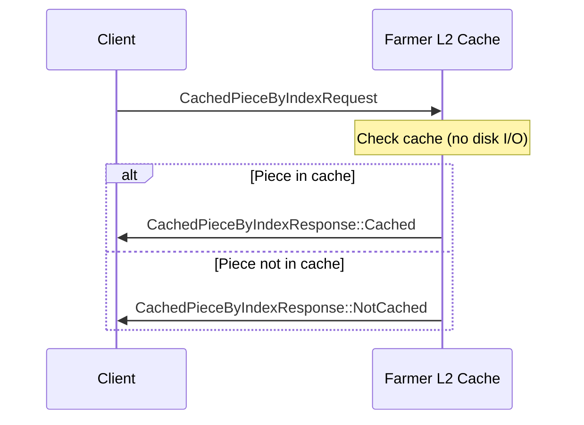
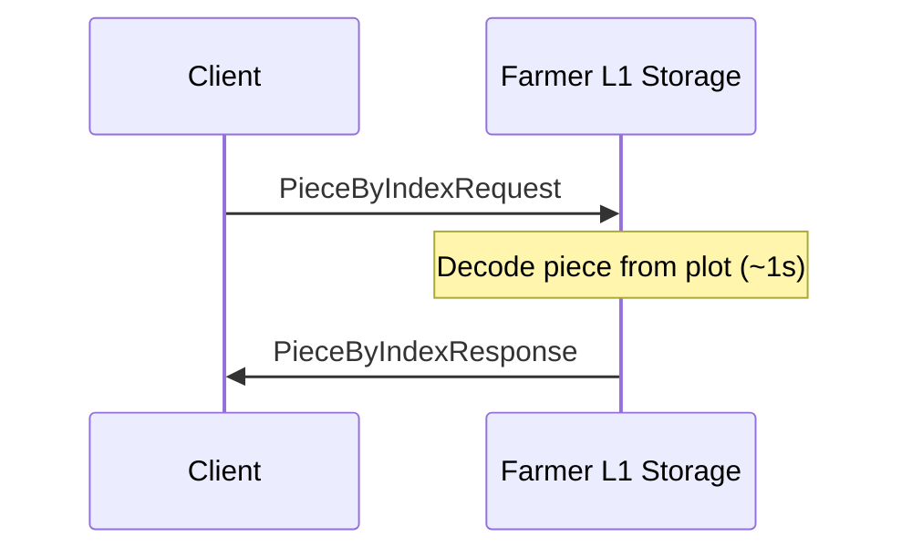
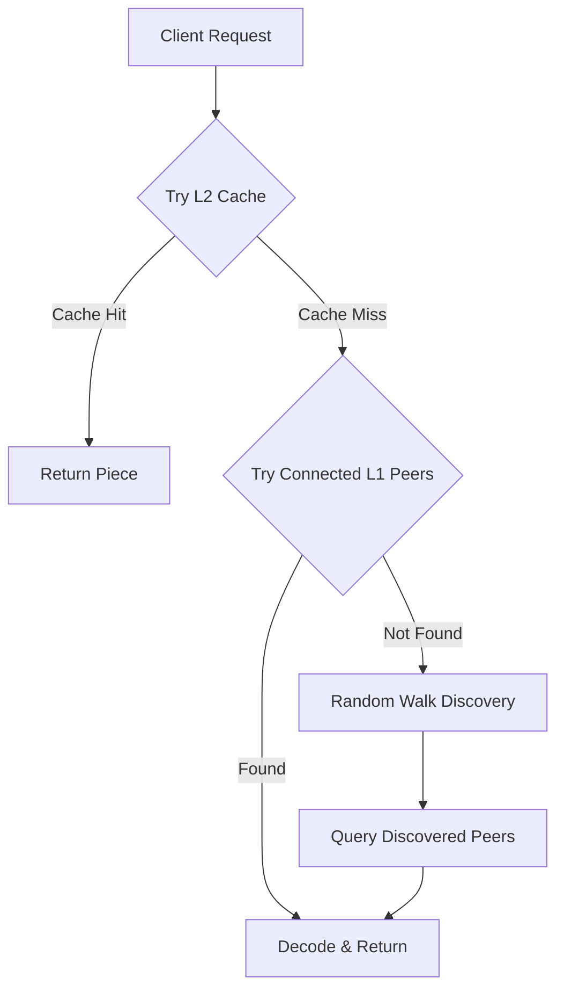

# DSN Protocols Specification

## 1. Overview

The DSN uses a request/response protocol built on top of libp2p for piece retrieval and metadata exchange. All protocols use SCALE codec for serialization.

📍 **Implementation**: [`crates/subspace-networking/src/protocols/request_response/`](https://github.com/autonomys/subspace/blob/main/crates/subspace-networking/src/protocols/request_response/)

## 2. Protocol Identifiers

| Protocol | ID | Version |
|----------|----|---------| 
| PieceByIndex | `/subspace/piece-by-index/1.0.0` | 1.0.0 |
| CachedPieceByIndex | `/subspace/cached-piece-by-index/1.0.0` | 1.0.0 |
| SegmentHeader | `/subspace/segment-header/1.0.0` | 1.0.0 |

## 3. Message Formats

### 3.1 PieceByIndexRequest

Used for retrieving pieces from L1 archival storage.

```rust
struct PieceByIndexRequest {
    /// The piece index being requested
    piece_index: PieceIndex,
    
    /// Additional pieces that requester is interested in if they are cached locally
    cached_pieces: Arc<Vec<PieceIndex>>,
}
```

📍 **Source**: [`crates/subspace-networking/src/protocols/request_response/handlers/piece_by_index.rs:13`](https://github.com/autonomys/subspace/blob/main/crates/subspace-networking/src/protocols/request_response/handlers/piece_by_index.rs#L13)

**Field Specifications:**
- `piece_index`: 64-bit unsigned integer representing the unique piece identifier
- `cached_pieces`: Optional list of additional piece indices the requester wants if available in cache

**SCALE Encoding:**
```
[piece_index: u64][cached_pieces_len: Compact<u32>][cached_pieces: Vec<u64>]
```

### 3.2 PieceByIndexResponse

Response to PieceByIndexRequest.

```rust
struct PieceByIndexResponse {
    /// The requested piece data (if available)
    piece: Option<Piece>,
    
    /// Additional pieces that requester is interested in and are cached locally
    cached_pieces: Vec<Piece>,
}
```

📍 **Source**: [`crates/subspace-networking/src/protocols/request_response/handlers/piece_by_index.rs`](https://github.com/autonomys/subspace/blob/main/crates/subspace-networking/src/protocols/request_response/handlers/piece_by_index.rs)

**Field Specifications:**
- `piece`: Optional 1MB piece data (exactly 1,048,576 bytes when present)
- `cached_pieces`: List of additional pieces from the request that were found in cache

**SCALE Encoding:**
```
[piece_present: u8][piece_data: [u8; 1048576]?][cached_pieces_len: Compact<u32>][cached_pieces: Vec<[u8; 1048576]>]
```

### 3.3 CachedPieceByIndexRequest

Used for retrieving pieces from L2 cache layer. Similar to PieceByIndexRequest but only returns cached pieces.

```rust
struct CachedPieceByIndexRequest {
    /// The piece index being requested
    piece_index: PieceIndex,
    
    /// Additional pieces that requester is interested in if they are cached locally
    cached_pieces: Arc<Vec<PieceIndex>>,
}
```

📍 **Source**: [`crates/subspace-networking/src/protocols/request_response/handlers/cached_piece_by_index.rs:23`](https://github.com/autonomys/subspace/blob/main/crates/subspace-networking/src/protocols/request_response/handlers/cached_piece_by_index.rs#L23)

**Constraints:**
- `RECOMMENDED_LIMIT`: Maximum 10 pieces in `cached_pieces` for optimal performance
- Implementations should handle larger requests but may truncate

### 3.4 CachedPieceByIndexResponse

Response containing only cached pieces.

```rust
enum CachedPieceByIndexResponse {
    /// Piece was found in cache
    Cached(PieceResult),
    /// Piece was not found in cache
    NotCached,
}

struct PieceResult {
    /// The piece data
    piece: Piece,
    
    /// Additional pieces from request that are also cached
    cached_pieces: Vec<Piece>,
}
```

📍 **Source**: [`crates/subspace-networking/src/protocols/request_response/handlers/cached_piece_by_index.rs`](https://github.com/autonomys/subspace/blob/main/crates/subspace-networking/src/protocols/request_response/handlers/cached_piece_by_index.rs)

### 3.5 SegmentHeaderRequest

Request for segment metadata.

```rust
struct SegmentHeaderRequest {
    /// Segment index being requested
    segment_index: SegmentIndex,
}
```

📍 **Source**: [`crates/subspace-networking/src/protocols/request_response/handlers/segment_header.rs`](https://github.com/autonomys/subspace/blob/main/crates/subspace-networking/src/protocols/request_response/handlers/segment_header.rs)

**Field Specifications:**
- `segment_index`: 64-bit unsigned integer representing the segment number

### 3.6 SegmentHeaderResponse

Response containing segment header data.

```rust
struct SegmentHeaderResponse {
    /// The segment header if available
    segment_header: Option<SegmentHeader>,
}
```

📍 **Source**: [`crates/subspace-networking/src/protocols/request_response/handlers/segment_header.rs`](https://github.com/autonomys/subspace/blob/main/crates/subspace-networking/src/protocols/request_response/handlers/segment_header.rs)

## 4. Protocol Flow

### 4.1 L2 Cache Retrieval



📍 **Implementation**: [`crates/subspace-farmer/src/bin/subspace-farmer/commands/shared/network.rs:129`](https://github.com/autonomys/subspace/blob/main/crates/subspace-farmer/src/bin/subspace-farmer/commands/shared/network.rs#L129)

### 4.2 L1 Archival Retrieval



📍 **Implementation**: [`crates/subspace-networking/src/utils/piece_provider.rs:232`](https://github.com/autonomys/subspace/blob/main/crates/subspace-networking/src/utils/piece_provider.rs#L232)

### 4.3 Full Retrieval Flow



📍 **Implementation**: [`crates/subspace-networking/src/utils/piece_provider.rs`](https://github.com/autonomys/subspace/blob/main/crates/subspace-networking/src/utils/piece_provider.rs)

## 5. Error Handling

### 5.1 Error Codes

| Code | Name | Description |
|------|------|-------------|
| 1 | PIECE_NOT_FOUND | Requested piece is not available |
| 2 | DECODE_ERROR | Failed to decode piece from storage |
| 3 | INVALID_REQUEST | Malformed request |
| 4 | TIMEOUT | Operation timed out |
| 5 | CAPACITY_EXCEEDED | Request exceeds limits |

### 5.2 Error Response Format

```rust
struct ErrorResponse {
    /// Error code
    code: u32,
    
    /// Human-readable error message
    message: String,
}
```

## 6. Performance Considerations

### 6.1 Request Limits

- Maximum pieces per `cached_pieces`: 10 (recommended)
- Maximum concurrent requests per peer: Implementation-defined
- Request timeout: 10 seconds (L2), 30 seconds (L1)

📍 **Constants**: [`crates/subspace-networking/src/protocols/request_response/handlers/cached_piece_by_index.rs:38`](https://github.com/autonomys/subspace/blob/main/crates/subspace-networking/src/protocols/request_response/handlers/cached_piece_by_index.rs#L38)

### 6.2 Caching Strategy

1. **L2 Cache Population:**
   - Based on DHT distance (proximity)
   - Automatic synchronization with new segments
   - LRU eviction when capacity reached

📍 **Implementation**: [`crates/subspace-farmer/src/farmer_cache.rs`](https://github.com/autonomys/subspace/blob/main/crates/subspace-farmer/src/farmer_cache.rs)

2. **Request Batching:**
   - Clients should batch related piece requests
   - Use `cached_pieces` field for efficiency

### 6.3 Network Optimization

- Connection reuse for multiple requests
- Parallel requests to different farmers
- Exponential backoff on failures

## 7. Security Considerations

### 7.1 Request Validation

- Verify piece index is valid (not future pieces)
- Limit request sizes to prevent DoS
- Rate limit requests per peer

### 7.2 Response Validation

- Verify piece size is exactly 1MB
- Validate piece commitment (implementation-specific)
- Check response size limits

📍 **Validation**: [`crates/subspace-farmer/src/farmer_piece_getter/piece_validator.rs`](https://github.com/autonomys/subspace/blob/main/crates/subspace-farmer/src/farmer_piece_getter/piece_validator.rs)

### 7.3 Transport Security

- All communication over libp2p with TLS
- Peer authentication via libp2p peer IDs
- No additional encryption needed

## 8. Implementation Notes

### 8.1 Piece Index Types

```rust
impl PieceIndex {
    /// Check if this is a source piece (not parity)
    pub fn is_source(&self) -> bool;
    
    /// Get position within segment
    pub fn source_position(&self) -> u32;
    
    /// Get next source piece index
    pub fn next_source_index(&self) -> PieceIndex;
}
```

📍 **Source**: [`crates/subspace-core-primitives/src/pieces.rs`](https://github.com/autonomys/subspace/blob/main/crates/subspace-core-primitives/src/pieces.rs)

### 8.2 Piece Structure

- Size: Exactly 1,048,576 bytes (1 MiB)
- Format: Raw bytes (L2) or encoded bytes (L1)
- Validation: Via KZG commitment

### 8.3 Connection Management

- Use libp2p connection pool
- Implement per-peer request queuing
- Handle connection failures gracefully

📍 **Implementation**: [`crates/subspace-networking/src/node_runner.rs`](https://github.com/autonomys/subspace/blob/main/crates/subspace-networking/src/node_runner.rs)

## 9. Backwards Compatibility

### 9.1 Version Negotiation

- Protocol version in protocol ID
- Fallback to older versions if needed
- Version-specific handlers

### 9.2 Migration Path

1. Deploy new protocol version
2. Support both old and new for transition
3. Deprecate old version after adoption
4. Remove old version support

## 10. Monitoring and Metrics

### 10.1 Required Metrics

- Request count by type
- Response times (p50, p95, p99)
- Error rates by error code
- Cache hit/miss ratios
- Bandwidth usage

📍 **Metrics**: [`crates/subspace-farmer/src/farmer_cache/metrics.rs`](https://github.com/autonomys/subspace/blob/main/crates/subspace-farmer/src/farmer_cache/metrics.rs)

### 10.2 Logging

- Log level INFO: Successful requests
- Log level WARN: Retriable errors
- Log level ERROR: Fatal errors
- Include piece index and peer ID 